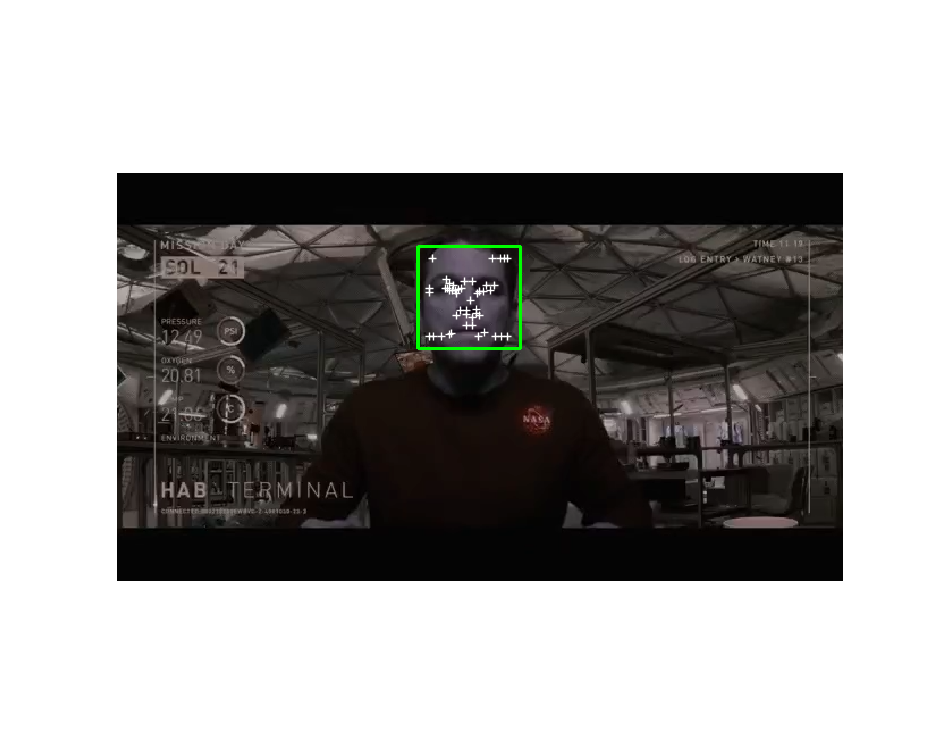
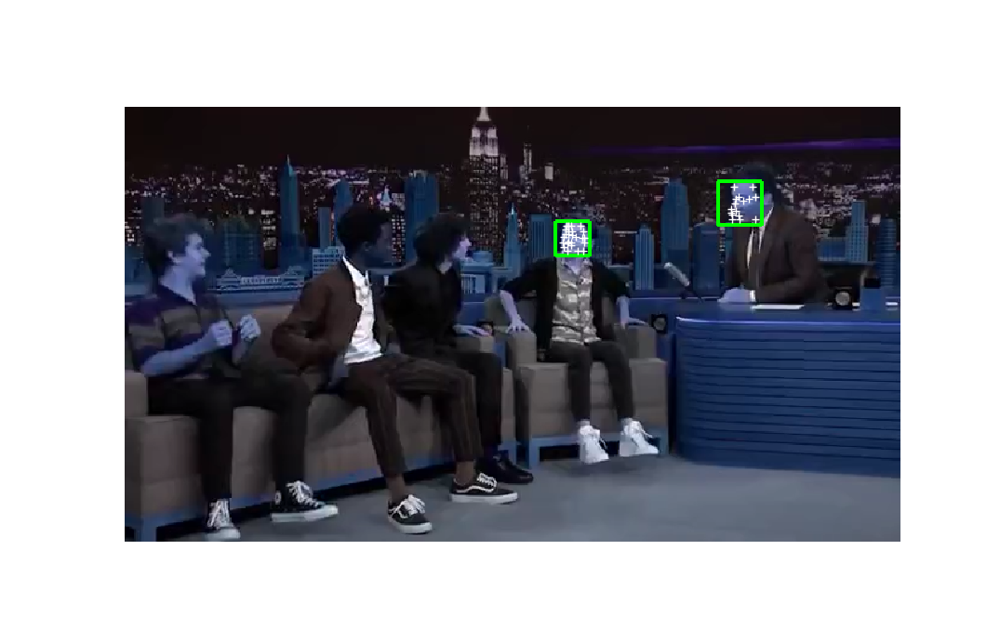

# Optical Flow Feature Detection
## Group 5: YueMeng Li, Yuanyuan Wang, Yu-Ho Hsieh

### File Structure:
#### Folders
* `Datasets`: all input videos
* `Haarcascade_Classifier`: two classifiers. We used `haarcascade_frontalface_alt.xml` classifier because it has better performance
* `Output_Video`: contains all types of output videos, including `.avi`, `.m4v`, `.mov`. Grade whichever opens on your laptop. 
* `First_Frame_with_Features`: contains all first frame images with feature points and boxes overlaid
* `Resources` is micellaneous, can be ignored 

#### Function Files
* `detectFace.py`: default `scaleFactor=1.1`. Adjust `scaleFactor=1.02` when running on `strangerthings.mp4`
* `helper.py`: contains `drawBox` function which copies image with feature box overlaid on it, and gaussian convolution function `gaussianPDF` which returns an operator for Ix and Iy

### To run test videos
`faceTracking.py`: main function produces the tracked videos. 
> To test on different input videos, change `rawvideo` file path and `tracked_video` file path. If a `tracked_video` with the same name already exist, videowriter does not override and will fail to produce new tracked video file. 

### First Frame of Test Videos 
note: the color scale is a bit off

#### Easy
#### Marques Brown Lee

#### The Martian

#### Medium
#### Tyrion Lannister

#### Hard 
#### Stranger Things
